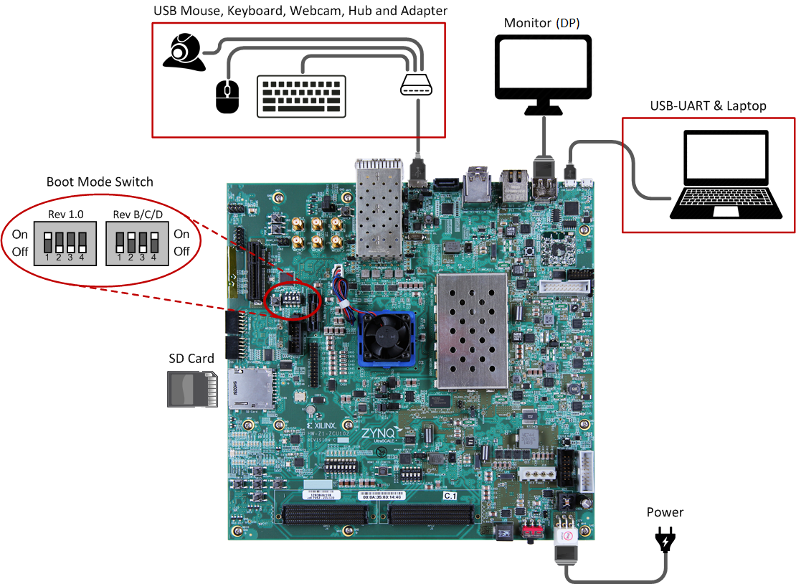

# SoC project

## Introduction
 The purpose of this project is to implement a partial reconfigurable IoT device, which can exchange parts of the synthesized hardware during runtime for a suitable application. 
 Android 8 is set up to run on the software processing unit of the Zynq UltraScale+ MPSoC ZCU102 Evaluation Kit.
 An application is presented that applies filters to given images. 
 These filters may be subject to updates in the future and the app is able to download such updates and apply them to the programmable logic using dynamic partial reconfiguration.
 
 This project is an extansion and improvement of the [Dynamic Partial Reconfiguration on an IoT device](https://github.com/FlorianMuttenthaler/SocLabPartialReconfigIot) project based on the Digilent ZedBoard.
 
 Android 8 for Xilinx Zynq UltraScale+ MPSoC is provided by [Mentor Embedded](https://www.mentor.com/embedded-software/semiconductors/xilinx/ultrascale): [Getting Started with Android 8 v2018.1 for Xilinx Zynq UltraScale MPSoC](https://github.com/MentorEmbedded/mpsoc-manifest/wiki/Getting-Started-with-Android-8-v2018.1-for-Xilinx-Zynq-UltraScale--MPSoC). 
 
## Initializing Build Environment

### Installing JDK
  Please check [AOSP: Installing the JDK](https://source.android.com/setup/build/initializing#installing-the-jdk) and [AOSP: JDK Requirements](https://source.android.com/setup/build/requirements#latest-version) for the detailed instructions to install proper version of the JDK. Please use **OpenJDK 8** to build **Android 8**. On Ubuntu 18.04 it can be installed with:

  `$ sudo apt-get install openjdk-8-jdk`

### Installing packages
  Please follow [AOSP: Installing Required Packages](https://source.android.com/setup/build/initializing#installing-required-packages-ubuntu-1404) to initialize build environment depending on your build host. Please note that builds are tested with 64-bit Ubuntu LTS 18.04.4 hosts. For the Ubuntu LTS 148.04.4 the following packages are required:

```shell
  $ sudo apt-get install git-core gnupg flex bison gperf build-essential zip curl zlib1g-dev gcc-multilib g++-multilib libc6-dev-i386 lib32ncurses5-dev x11proto-core-dev libx11-dev lib32z-dev libgl1-mesa-dev libxml2-utils xsltproc unzip
```
  In addition to the packages from the AOSP guide, please install the following for the SD card initialization scripts:

  `$ sudo apt-get install dosfstools e2fsprogs parted`

## Project structure
 The project is structured as follows:
 
 ```
 .
 ├── android			# contains android files
 ├── arm-trusted-firmware	# contains arm firmware files
 ├── bootimage 			# contains built files
 ├── build-files 		# contains necessary files
 ├── client 			# contains android app
 ├── device-tree-xlnx 		# contains device-tree files
 ├── drivers 			# contains kernel modules for custom hardware components
 ├── hardware_design		# contains the hardware design
 ├── hdmi-modules		# contains hdmi kernel modules
 ├── mpsoc-linux-xlnx		# contains kernel files
 ├── mpsoc-u-boot-xlnx		# contains u-boot files
 ├── prebuilt			# contains prebuilt files ready to use
 ├── report			# contains project report
 └── server			# contains file server
 ```
 
## Project progress
 - [X] Make Android bootable
 - [ ] Enable HDMI output 
 - [X] Add custom hardware
 - [X] Enable dynamic partial reconfiguration
 - [ ] Customize the Android app and make it work
 - [ ] Add server and make it work
 
## Building the code
 There are two script files in the bootimage directory:
 ```shell
 $ cd WORKING_DIRECTORY/bootimage
 $ ./generate_without_android.sh    # used to generate hardware design and linux components
 $ ./generate_including_android.sh  # used to generate android
 ```
 These two scripts generate all the files necessary to start the system.
  
## Preparing SD Card
 Run the following script to prepare bootable SD card. 
 Use path to your SD card instead of `/dev/mmcblk0`. 

 ```shell
 $ cd WORKING_DIRECTORY
 $ sudo bootimage/mkSDcard.sh /dev/mmcblk0 populate
 ```
 
## Running the Build on the Xilinx ZCU102
 - Use default [ZCU102 User Guide](https://www.xilinx.com/support/documentation/boards_and_kits/zcu102/ug1182-zcu102-eval-bd.pdf) as a reference for switches and connectors location.
 - Set boot mode of the board to "SD Boot". 
 - Insert SD card to the board.
 - Connect external monitor using HDMI. Please note that HDMI must be connected before board power-on.
 - Connect USB mouse and USB keyboard using USB hub as shown below.
 - Power on the board
 <p align="center">
 
 </p>
